# E‑Commerce Microservices — Capstone

This project demonstrates a production-ready e‑commerce platform built with Spring Boot microservices, showcasing Kafka (async messaging), Redis (cache & vector store), Eureka (service discovery), API Gateway, and an AI‑powered recommendation service.

## Microservices
- **ProductServiceCapstone** — product catalog, caching, and AI recommendations via Spring AI + OpenAI.
- **UserServiceCapstone** — user management and authentication.
- **PaymentServiceCapstone** — payment processing (stubbed for demo).
- **EmailServiceCapstone** — async notifications (Kafka consumers).
- **APIGatewayCapstone** — single API entrypoint (Spring Cloud Gateway).
- **ServiceDiscoveryCapstone** — Eureka registry.

## Architecture (Mermaid)

```mermaid
flowchart LR
  Client[Web/Mobile] --> Gateway[API Gateway]
  Gateway --> Product[Product Service]
  Gateway --> User[User Service]
  Gateway --> Payment[Payment Service]
  Product --> Redis[(Redis Cache)]
  Product --> Kafka
  User --> Kafka
  Kafka --> Email[Email Service]
  Product --> AI[Spring AI / OpenAI]
  classDef svc fill:#000,stroke:#333,stroke-width:1px;
  class Product,User,Payment,Email svc;
```


## Tech Stack
- **Java 17**, **Spring Boot 3+**
- **MySQL**, **Kafka**, **Redis**
- **Eureka**, **Spring Cloud Gateway**
- **Spring AI / OpenAI** for recommendations

## Design Highlights
- Microservice decomposition → scalability, independent deployability.
- Async events via Kafka → non-blocking email notifications.
- Redis caching & vector store → high performance + AI similarity search.
- OpenAI integration → demonstrates AI augmentation on backend.

## Run Locally
```bash
docker compose up -d
cd ProductServiceCapstone && ./mvnw spring-boot:run
```
Then access APIs via Gateway (default port 8080).

## Key Takeaway
- Demonstrates event-driven architecture, cache optimization, and AI‑integration.
- Clean modular codebases ready for independent scaling.
